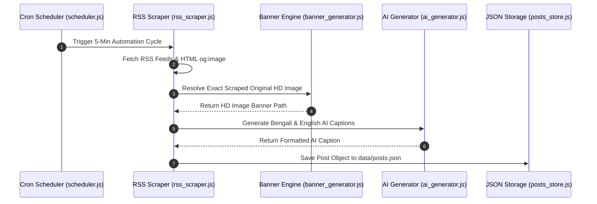

# 02. Architecture & Data Pipeline

## 🏗️ Technical Stack

```
   [ Client Browser ]
           │  (REST API / JSON)
           ▼
  ┌─────────────────────────────────────────────────────────────┐
  │ Express.js Server (server.js - Node.js 20 LTS)              │
  ├──────────────────────────────┬──────────────────────────────┤
  │  Storage Layer               │  Scraper & Scheduler         │
  │  • data/posts.json           │  • rss_scraper.js (Cheerio) │
  │  • data/sources.json         │  • node-cron (5-Min Cycle)   │
  │  • data/pages.json           │  • banner_generator.js       │
  └──────────────┬───────────────┴──────────────┬───────────────┘
                 │                              │
                 ▼                              ▼
        [ Local Disk Storage ]       [ External AI APIs ]
        • /public/generated_banners  • Groq Llama-3.3-70B
        • Cambria Font CSS           • Gemini 1.5 Flash
                                     • Pollinations FLUX.1
```

---

## 🔄 Automated 5-Minute Data Pipeline Flow



---

## 📂 Storage Model

All persistent data is safely stored in light JSON databases under the `data/` directory:

| Storage File | Description |
| :--- | :--- |
| `data/posts.json` | Master database of scraped articles, AI captions, attached photos, category, and publish status. |
| `data/sources.json` | Configured RSS news sources, categories, active toggles, and `pinned` top priority flags. |
| `data/pages.json` | Configured target Facebook Pages, access tokens, and category mappings. |
| `public/generated_banners/` | Local directory storing scraped HD article banners and AI graphics. |
